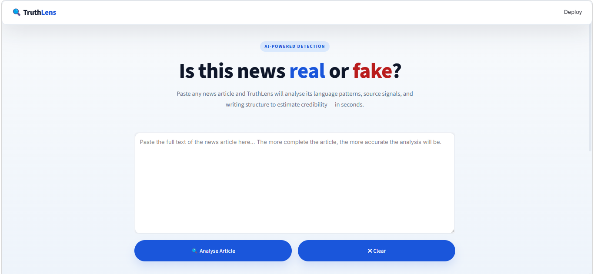
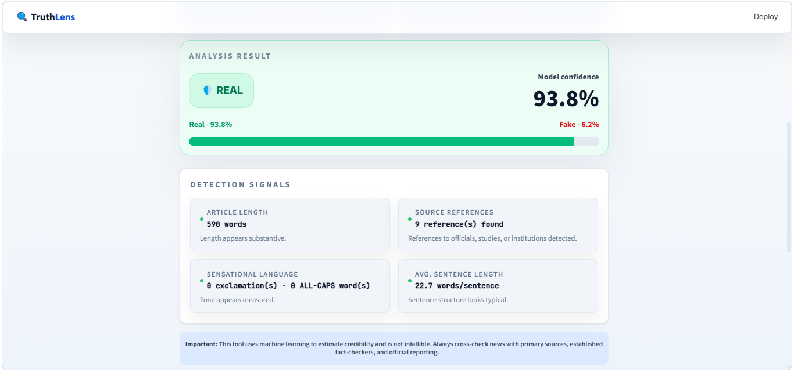
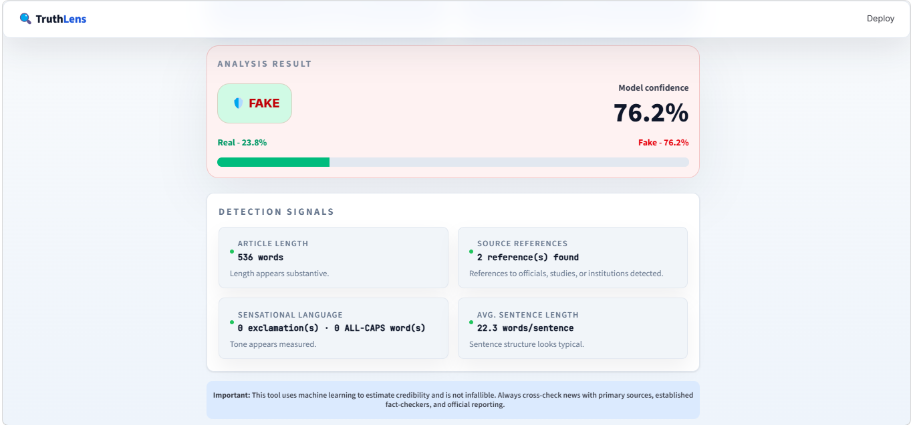

# 📰 TruthLens – Fake News Detection System

> A Machine Learning-powered web application for detecting fake news articles using Natural Language Processing (NLP) and a Passive Aggressive Classifier.


---

# 📖 Overview

TruthLens is a web-based fake news detection system developed as a final-year Computer Science project. The application uses Natural Language Processing (NLP) and Machine Learning techniques to analyze news articles and classify them as **REAL** or **FAKE**.

Instead of fact-checking news against online sources, the system learns linguistic patterns from previously labeled news articles and predicts whether new articles resemble genuine or fake news.

The application features a clean Streamlit interface, confidence scoring, prediction logging, English-language validation, and an explanation panel that highlights the signals influencing each prediction.

---

# 🚀 Live Demo

[https://truthlensapp.streamlit.app/]

---

# 📸 Screenshots

## Home Page



---

## Prediction Result (REAL)



---

## Prediction Result (FAKE)



---

# 🛠 Features

- Machine Learning-based fake news detection
- Natural Language Processing (NLP)
- TF-IDF feature extraction
- Passive Aggressive Classifier
- English-language validation
- Confidence score for every prediction
- Detection signal summary
- Automatic prediction logging
- Responsive Streamlit interface
- Clean and intuitive user experience

---

# 🧠 Machine Learning Pipeline

The system follows the workflow below:

``` text
User Input
      │
      ▼
Text Preprocessing
      │
      ▼
English Language Validation
      │
      ▼
TF-IDF Vectorization
      │
      ▼
Passive Aggressive Classifier
      │
      ▼
Prediction
      │
      ▼
Confidence Score + Detection Signals
      │
      ▼
Prediction Logging
```

---

# ⚙ Technology Stack

| Category | Technology |
|-----------|------------|
| Programming Language | Python |
| Web Framework | Streamlit |
| Machine Learning | Scikit-learn |
| Feature Extraction | TF-IDF Vectorizer |
| Model | Passive Aggressive Classifier |
| Data Processing | Pandas |
| Numerical Computing | NumPy |
| NLP | NLTK |
| Language Detection | LangID |
| Model Storage | Joblib |
| Version Control | Git & GitHub |

---

# 📂 Project Structure

```text
fakeNewsDS/
│
├── Models/
│   ├── trained_model.pkl
│   ├── tfidf_vectorizer.pkl
│   ├── model_metadata.json
│   └── model_metrics.json
│
├── truthlens/
│   ├── truthlens_app.py
│   ├── truthlens_detection_system.py
│   ├── style.css
│   ├── requirements.txt
|   |── images
│   └── README.md
│
├── logs/
│
├── process.ipynb
├── requirements.txt
├── confusionmatrix.png
├── cross_validation_results.json
```

---

# 📊 Model Information

| Item | Value |
|------|-------|
| Model | Passive Aggressive Classifier |
| Feature Extraction | TF-IDF |
| Dataset | ISOT Fake News Dataset |
| Programming Language | Python |
| Deployment | Streamlit |

---

# 📈 Model Performance

| Metric | Score |
|---------|------:|
| Accuracy | 99.38% |
| Precision | 99.32% |
| Recall | 99.37% |
| F1 Score | 99.34% |

---

# 📁 Dataset

This project was trained using the **ISOT Fake News Dataset**.

To keep the repository lightweight and comply with GitHub's file size limits, the training dataset is **not included** in this repository.

You can obtain the dataset from its original source and place it inside the `Datasets/` directory if you wish to retrain the model.

---

# 🚀 Installation

## 1. Clone the repository

```bash
git clone https://github.com/zootodev/fake-news-detection-system.git
cd fakeNewsDS
```

---

## 2. Create a virtual environment

### Windows

```bash
python -m venv .venv
.\.venv\Scripts\activate
```

### macOS / Linux

```bash
python3 -m venv .venv
source .venv/bin/activate
```

---

## 3. Install dependencies

```bash
pip install -r requirements.txt
```

---

## 4. Run the application

```bash
streamlit run truthlens/truthlens_app.py
```

The application will open in your browser at:

```
http://localhost:8501
```

---

# 💻 Usage

1. Launch the application.
2. Paste an English news article into the input box.
3. Click **Analyze Article**.
4. View:
   - Prediction (REAL or FAKE)
   - Confidence score
   - Detection signals
5. Repeat for additional articles.

---

# 📝 Prediction Logging

Every prediction is automatically stored in:

```
logs/prediction_logs.csv
```

The log includes:

- Timestamp
- Article snippet
- Prediction
- Confidence score
- Model version
- Processing duration

---

# ⚠ Limitations

- Supports English-language news articles only.
- Focuses on only textual contents, does not analyse images, videos or other forms of media.
- Does not verify news against live online sources.
- Predictions are probabilistic and should not be considered definitive fact-checking.
- Performance depends on the quality and diversity of the training dataset.

---

# 🔮 Future Improvements

- Multilingual support
- Image and Video verification mechanisms
- Integration with live fact-checking APIs
- Explainable AI using SHAP/LIME
- Transformer-based models (e.g., BERT)
- Browser extension
- Mobile application
- User feedback and correction system

---

# 👨‍💻 Author

**Olufunmilayo Ifeoluwani Joshua**

Final-Year Computer Science Student  
Achievers University, Owo, Nigeria

GitHub: https://github.com/zootodev

---

# 🙏 Acknowledgements

Special thanks to:

- Achievers University
- My project supervisor
- The creators of the ISOT Fake News Dataset
- The open-source Python community
- Streamlit and Scikit-learn contributors

---

# 📜 License

This project is licensed under the **MIT License**.

See the `LICENSE` file for more information.
